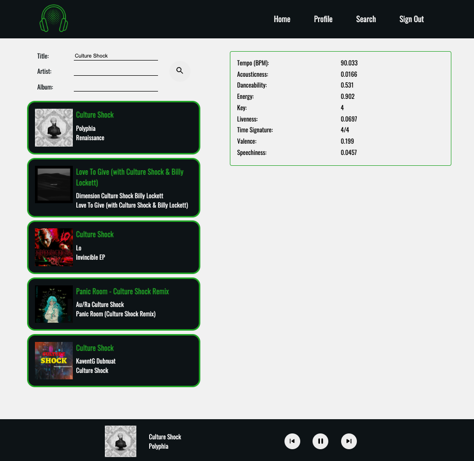

# Spotavibe

A web application that lets you search for songs based on Spotify’s song classification parameters and save them to your playlists.

## Technologies

- React
- Node
- Express
- Jest
- React Testing Library
- Webpack
- MongoDB
- SASS
- OAuth 2.0

## Screenshots

